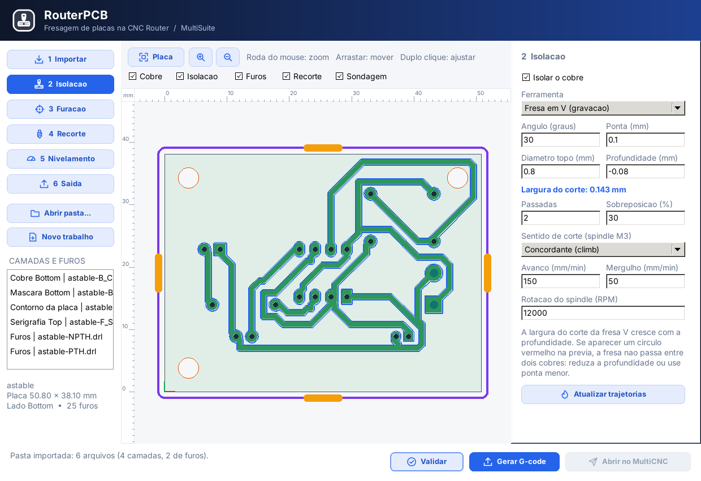
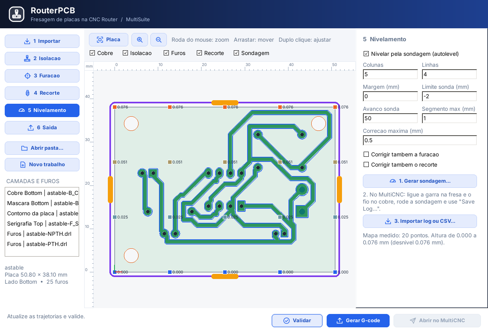
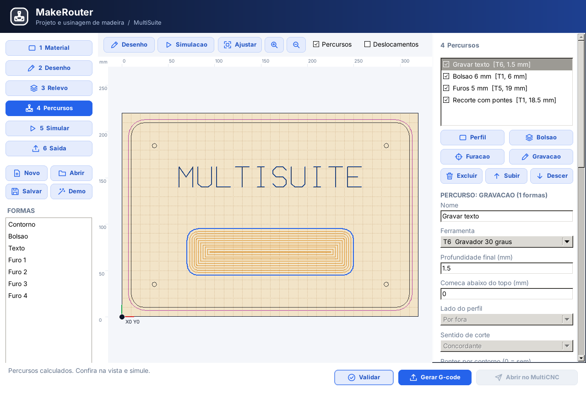
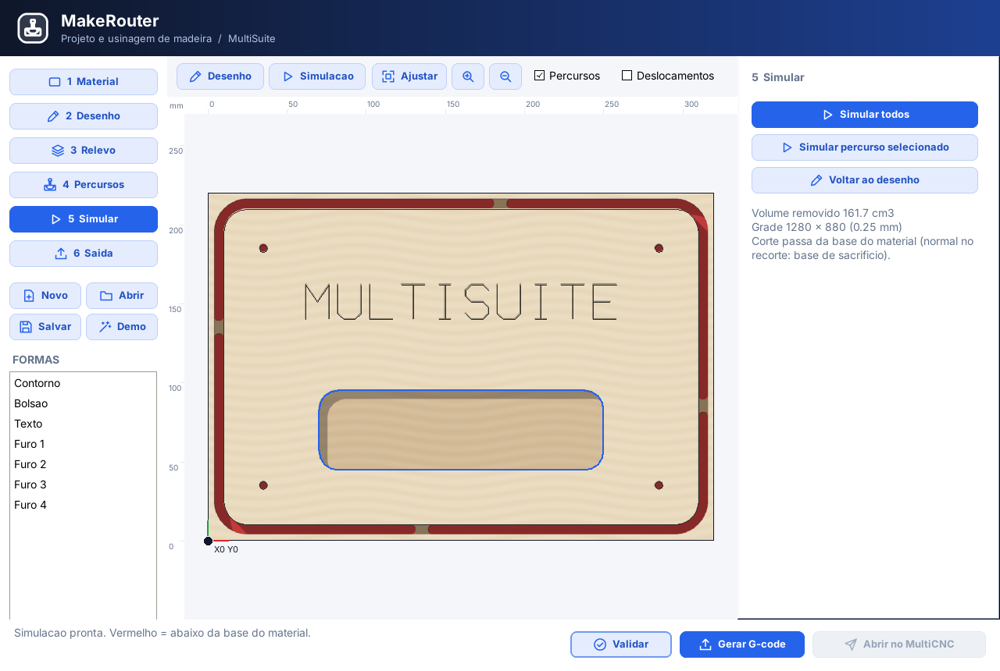

# MultiCNC

**Idiomas:** Português · [English](README_EN.md) · [Español](README_ES.md) · [Français](README_FR.md) · [Deutsch](README_DE.md) · [Русский](README_RU.md) · [中文](README_ZH.md) · [العربية](README_AR.md) · [हिन्दी](README_HI.md)

## Uma plataforma integrada para projetar, simular e fabricar

O **MultiCNC** é uma suíte aberta de fabricação digital criada para aproximar, em um único ecossistema, as etapas de **projeto, preparação, simulação e operação de máquinas**.

A proposta vai além de um simples programa para enviar G-code. O projeto busca oferecer uma experiência integrada para quem trabalha com **CNC Router, CNC Laser, impressão 3D, eletrônica, PCB, montagem eletromecânica e simulação física**.

> **Uma ideia, vários processos, um único ambiente.**

### Visão do projeto

O objetivo do MultiCNC é reduzir a fragmentação do processo de fabricação digital. Em vez de depender de várias ferramentas desconectadas, a suíte procura reunir aplicações especializadas que trabalham de forma complementar, desde a criação e preparação do projeto até sua validação e execução na máquina.

```text
IDEIA
  ↓
PROJETO
  ↓
SIMULAÇÃO
  ↓
PREPARAÇÃO
  ↓
VALIDAÇÃO
  ↓
FABRICAÇÃO
```

### O que faz parte do ecossistema

| Aplicação | Visão |
|---|---|
| **MultiCNC** | Operação e controle das máquinas |
| **MultiSuite** | Ponto de entrada para toda a suíte |
| **MultiCAD** | Projeto e preparação geométrica |
| **MultiCAM** | Preparação de trajetórias e fabricação |
| **MakeRouter** | Projeto e usinagem de madeira na CNC Router |
| **MultiSlicer** | Preparação para impressão 3D |
| **MultiPCB / MakePCB / LaserPCB / RouterPCB** | Projeto e fabricação de placas eletrônicas (laser ou fresagem) |
| **MultiAssembly** | Integração de mecânica e eletrônica em uma montagem |
| **MultiPhysics** | Simulação física multidomínio |

### CNC Router, Laser e impressão 3D

O MultiCNC foi pensado para trabalhar com diferentes processos de fabricação. Na **CNC Router**, o foco está na preparação e execução de usinagem. No **CNC Laser**, o usuário pode preparar trabalhos de gravação, corte e picote, além de conferir o posicionamento do material antes da execução. Na **impressão 3D**, a proposta é integrar a preparação do modelo e sua fabricação ao mesmo ecossistema.

No modo Laser, por exemplo, o recurso de **contorno da área de trabalho** permite conferir onde o desenho será executado antes de iniciar, ajudando o operador a verificar se a peça está bem posicionada e se o trabalho cabe no material. As configurações específicas de laser incluem potência, velocidade, passadas, tipo de operação e assistência de ar.

### Simular antes de fabricar

O **MultiPhysics** amplia a proposta da suíte ao permitir estudar o comportamento do projeto antes de levá-lo para a máquina real. A visão inclui elementos mecânicos, elétricos, eletrônicos, materiais, sensores, motores, forças, movimentos e outros fenômenos físicos em um ambiente integrado.

### Inteligência Artificial como assistência

A inteligência artificial faz parte da evolução do projeto como uma camada de apoio ao usuário. Ela pode auxiliar na análise de projetos, interpretação de comandos, preparação de trabalhos, diagnóstico e orientação, sempre mantendo a decisão e a operação da máquina sob controle do usuário.

### Para quem é o MultiCNC

O projeto é voltado a **makers, estudantes, professores, escolas técnicas, universidades, FabLabs, laboratórios, pesquisadores, desenvolvedores, profissionais de automação e pequenas oficinas**.

O MultiCNC também funciona como ambiente de estudo e experimentação em manufatura digital, CAD/CAM, eletrônica, controle de máquinas e simulação.

### Projeto aberto e em evolução

O MultiCNC é **open source** e está em desenvolvimento contínuo. Os módulos da suíte podem estar em diferentes níveis de maturidade, por isso a documentação técnica abaixo informa o papel de cada aplicação e o estado dos recursos.

---

## Qual aplicação devo usar?

| Aplicação / módulo | O que faz | Use quando quiser |
|---|---|---|
| **MultiCNC** | Análise de G-code, prévia e envio simulado; núcleo de protocolos e transportes | Inspecionar trabalhos e testar o envio antes da integração com hardware |
| **MultiSuite** | Projetos globais, arquivos, workflow manual e launcher | Criar, salvar, reabrir e organizar um projeto, escolhendo a ferramenta de cada arquivo |
| **MultiPhysics** | Simulação física multidomínio | Estudar eletricidade, eletrônica, mecânica, térmica, magnetismo, materiais, sensores, motores, energia e falhas |
| **Ferramentas de projeto mecânico** | Projeto e preparação de peças e conjuntos | Trabalhar com geometria, peças mecânicas, montagem e preparação para CNC Router |
| **Ferramentas de PCB/eletrônica** | Projeto de circuitos e placas | Trabalhar com esquemas, componentes, conexões e PCB |
| **MakePCB** | Placa do zero, no estilo PCB Wizard | Desenhar esquema e placa e gerar Gerber + Excellon para o LaserPCB ou o RouterPCB |
| **RouterPCB** | Fresagem de PCB na CNC Router | Isolar trilhas com fresa V, furar e recortar a placa a partir do Gerber + Excellon |
| **Ferramentas Laser** | Preparação de desenhos, imagens, logos e trabalhos para laser | Criar ou preparar arte para corte e gravação a laser |
| **MakeRouter** | Projeto e usinagem de madeira, no estilo do Aspire | Desenhar a peça, fazer relevo, percursos (perfil, bolsão, furação, V-Carve, 3D), simular e mandar ao MultiCNC |
| **Ferramentas CNC Router/CAM** | Preparação de usinagem mecânica | Preparar operações, trajetórias e trabalhos para Router |
| **Montagem eletromecânica** | Visualização conjunta de mecânica e eletrônica | Ver componentes mecânicos, placas, sensores, motores e conexões no mesmo projeto |
| **Central de Testes** | Executa os testes de console incluídos no pacote | Verificar os núcleos instalados e salvar um relatório por usuário |

MultiCNC analisa G-code e simula o envio; MultiPhysics simula o comportamento físico; as ferramentas de projeto criam e preparam o projeto; MultiSuite organiza os arquivos e abre as aplicações.

## Funcionalidades disponíveis nas interfaces

| Aplicação | Fluxo implementado |
|---|---|
| MultiSuite | Novo/abrir/salvar/salvar como `.msuite`, recentes, adicionar/remover arquivos e selecionar a ferramenta responsável; MultiPhysics permanece registrado. Etapas do workflow são atualizadas manualmente. |
| MultiCNC | Abre `--file`, diálogo ou arquivo arrastado; preserva comentários, calcula a trajetória no analisador existente, apresenta vistas XY/XZ/YZ, limites editáveis, avisos e relatório exportável. Erros bloqueiam o início da simulação. |
| MultiSlicer | Importa STL, configura camadas, paredes, infill, mesa, bico, velocidade, temperaturas e Marlin/Klipper; mostra percursos por camada. Prévia e exportação usam o mesmo pipeline e alterações invalidam o resultado anterior. |
| Central de Testes | Procura testes na instalação ou árvore de desenvolvimento; executa em pastas temporárias, captura stdout/stderr e códigos de saída e grava relatórios em uma pasta gravável do usuário. |

Os recursos de protocolo, streaming e TCP estão no núcleo. A GUI MultiCNC ainda usa o simulador; não anuncia conexão física nem telemetria como disponíveis na tela. O analisador assume a origem de trabalho X0 Y0 Z0 e sinaliza operações que tornam a análise parcial. Veja [o painel](src/app/README.md) e [o fluxo integrado](docs/FLUXOS_IMPLEMENTADOS.md).

Os arquivos de `releases/0.1.0` são históricos e anteriores aos commits `960dbafd`/`67682e1a` do painel. Os novos pipelines geram **0.1.1-dev** como artefatos do Actions, com `build-manifest.json`, `qa-tests.json` e `SHA256SUMS`. A existência de um workflow não comprova aprovação: confira o run e o commit de origem do artefato antes de publicar uma release.

## Motores da modernização de 2026

O núcleo recebeu os recursos abaixo em Object Pascal (FPC/Lazarus). Disponibilidade de um motor não significa que todos os seus parâmetros já possuem uma tela; a tabela anterior delimita os fluxos atuais de interface. Builds e verificações usam também Python 3.9 ou superior.

| Ferramenta | O que entrou |
|---|---|
| **MultiCNC** | Telemetria Grbl/grblHAL/FluidNC (status `<...>`, `ALARM`/`error` com texto), overrides em tempo real, envio por *character-counting* (Grbl) e linhas numeradas com checksum/`Resend` (Marlin), drivers **grblHAL** e **FluidNC**, transporte **TCP/telnet**, análise prévia de G-code com estimativa de tempo pelo modelo de *junction deviation* do Grbl e verificação do envelope da máquina (`multicnc_cli --check arquivo.nc`). |
| **MultiCAM** | Fresamento **trocoidal**, pocket por **offsets** com entrada helicoidal, perfil com **compensação de raio**, rampa e tabs, calculadora de avanços e rotações com **afinamento de cavaco**, pós-processador modal com **arc fitting G2/G3** (perfil típico cai de 516 para 190 linhas). |
| **LaserArt / LaserPCB** | Rasterização em **escala de cinza** (potência variável), dithering Floyd-Steinberg, Jarvis, Stucki, Atkinson, Sierra, Burkes e Bayer com varredura serpentina, **overscan**, varredura bidirecional, salto de áreas brancas, modo laser dinâmico `M4` e G-code modal. |
| **MultiSlicer** | Contornos com furos, **perímetros**, topo/fundo sólidos, infill **gyroid**, **altura de camada adaptativa**, extrusão volumétrica, sabores **Marlin** e **Klipper** (`M73`, `M486`/`EXCLUDE_OBJECT`, pressure advance), retração só ao cruzar perímetros, arcos nos perímetros, STL binário e **3MF**. |
| **MultiPCB** | **Gerber X2** com netlist embutida e funções de abertura, **Gerber Job** (`.gbrjob`), Excellon com tabela de ferramentas, **DRC de clearance** e **autorouter A\*** de duas camadas com vias. |
| **MultiPhysics** | Solver de circuitos **Newton-Raphson global** (diodo e MOSFET dentro da MNA, *gmin/source stepping*, regra trapezoidal) e integradores **RK4**, **Dormand-Prince 45** adaptativo e **Velocity Verlet**. |
| **MultiCAD** | **Solver de restrições** (Levenberg-Marquardt) com análise de **graus de liberdade** e detecção de conflitos, extrusão para malha fechada com furos, exportação **STL** e **3MF** (lida diretamente pelo MultiSlicer). |
| **MultiAssembly** | **ERC eletromecânico** (drivers sem STEP/DIR, tensões incompatíveis, E-stop...), **BOM** CSV/JSON e geração dos parâmetros **Grbl `$100`–`$132`** e do YAML do **FluidNC** a partir da cinemática. |
| **Geometria compartilhada** | `src/shared/multisuite_geometry` (offset, recorte, contornos) e `multisuite_arcfit` (G2/G3), usadas por CAM, Slicer e CAD. |

Correções incluídas: compensação Z do PCB passou a usar interpolação **bilinear** em grade (o IDW anterior subestimava a inclinação: 0,04 mm de erro num desnível de 0,2 mm), leitura de STL ASCII em sistemas com vírgula decimal (pt-BR), workspace do MultiSuite salvo sem diretório, remoção de material com espessura de stock não informada e relação mecânica não inicializada na demonstração do MultiAssembly.

### Testes

```bash
bash tests/run_all.sh            # todos os módulos
bash tests/run_all.sh multicam   # um módulo
```

O script descobre os testes de console, compila com `fpc` e executa cada um. Os executáveis ficam ao lado de cada `.lpr`, onde a Central de Testes os encontra. O workflow **Suite CI** roda os testes, compila todos os `.lpi` e executa testes das interfaces MultiCNC, MultiSuite e MultiSlicer com Xvfb. Relatórios estruturados registram cada resultado; compilar sem executar é registrado como `not-run`.

```bash
python3 tools/verify_suite.py gui --run  # Lazarus/GTK2, Xvfb e xauth
```

---

## 1. MultiCNC — controle da máquina

O **MultiCNC** é a aplicação voltada ao controle e operação de máquinas de fabricação digital.

Seu núcleo separa quatro conceitos: **tipo de máquina**, **protocolo/firmware**, **transporte** e **execução de G-code**.

### Máquinas previstas

- **CNC Router:** XYZ, spindle, RPM, probe, zero da peça e ferramentas.
- **Laser CNC:** XY, potência, velocidade, frame, foco e air assist quando suportado.
- **Impressora 3D:** XYZ, hotend, mesa, extrusor, fan e temperaturas.

### Arquitetura

```text
UI
 |
Machine Manager
 |
CNC Core
 |-- Machine Profile
 |-- Machine State
 |-- Safety
 |-- Job Manager
 |-- G-code Engine
 |
Protocol Drivers            Streaming
 |-- GRBL                    |-- character-counting (Grbl/grblHAL/FluidNC)
 |-- grblHAL                 |-- send-response
 |-- FluidNC                 |-- Marlin: checksum + Resend
 |-- Marlin
 |
Transport
 |-- Serial (CHATGPT/TAISerialModem)
 |-- TCP/IP (FluidNC/grblHAL via telnet)
 |-- Simulator
```

### Regra fundamental

Tipo de máquina, protocolo e transporte são independentes. Por exemplo, Router e Laser podem utilizar GRBL, enquanto diferentes máquinas podem utilizar Serial, TCP/IP ou simulador.

Use o **MultiCNC** quando o objetivo final for **controlar ou operar uma máquina**.

### Modelos públicos de teste

Arquivos de exemplo ficam em [`models`](models/), separados por `printer3d`,
`cnc_router` e `cnc_laser`. Cada subpasta informa a origem, a licença CC0-1.0
e o formato do programa. São trajetórias pequenas para leitura e simulação;
confira sempre os parâmetros antes de usar qualquer arquivo em hardware real.

### SimuCNC e conexão serial

O **SimuCNC** é uma aplicação separada que recebe comandos Marlin pela serial,
responde como equipamento e apresenta movimentos e extrusão em 3D. O **MultiCNC**
é a controladora conectada a esse equipamento simulado.

A ligação pode usar **dois adaptadores USB–serial cruzados**, dispensando o
com0com, ou um par de portas virtuais com driver compatível com o Windows.
No modo serial, é necessária uma ligação funcional entre duas portas distintas.
Também é possível usar o [servidor TCP do SimuCNC](docs/SIMUCNC_TCP.md), sem COM ou com0com.

#### Dois adaptadores USB–serial

Conecte TX de um adaptador ao RX do outro, RX ao TX e GND ao GND.
**Não conecte VCC.** Use padrões e níveis elétricos compatíveis: não misture
TTL com RS-232. Adaptadores RS-232 usam cabo null-modem com pinagem adequada.

Cada adaptador deve aparecer como uma COM no Windows. Configure o MultiCNC em
uma COM e o SimuCNC na outra, com o mesmo baud rate (por exemplo, 115200), 8N1 e
sem controle de fluxo. No SimuCNC, clique em **Iniciar Marlin**, sem usar
**Criar par virtual**.

Consulte o [guia de ligação serial do SimuCNC](docs/SIMUCNC_COM0COM.md) para
pinagem, configuração, diagnóstico e a alternativa com com0com no Windows 11.

---

## 2. MultiSuite — gestor unificado

O **MultiSuite** é o ponto central para reunir as aplicações do projeto.

Sua função é facilitar o acesso às ferramentas sem obrigar o usuário a conhecer a estrutura interna do repositório ou procurar cada executável manualmente.

A proposta é permitir selecionar o tipo de trabalho e abrir a ferramenta apropriada: controle CNC, projeto mecânico, PCB, Laser, Router, montagem, simulação ou testes.

Use o **MultiSuite** quando quiser **entrar na suíte por uma única aplicação e escolher o que deseja fazer**.

---

## 3. MultiPhysics — simulador físico

O **MultiPhysics** é o ambiente experimental de simulação física e de engenharia.

Ele procura representar uma máquina ou sistema completo, permitindo que diferentes domínios físicos participem da mesma simulação.

### Eletricidade e eletrônica

Inclui modelos e bibliotecas para fontes, baterias, resistores, capacitores, indutores, transformadores, LEDs, diodos, transistores, MOSFETs, IGBTs, amplificadores, fusíveis, relés, conversores, ponte H, drivers e circuitos digitais.

### Processadores e controle

Há modelos orientados a periféricos para **ATmega328P/Arduino, ESP32, RP2040, STM32 e MCU genérico**, incluindo GPIO, ADC, PWM, memória, clock e interfaces de controle.

### Motores, atuadores e sensores

O ambiente contempla motores DC, stepper, servo, BLDC e AC, além de solenoides, atuadores lineares, eletroímãs, bombas, ventiladores, aquecedores e diversos sensores de posição, velocidade, temperatura, corrente, tensão, pressão, força, Hall, proximidade, encoder, aceleração e outras grandezas.

### Mecânica

Os modelos incluem massa, força, torque, posição, velocidade, aceleração, gravidade, tração, atrito estático/cinético, resistência ao rolamento, transmissão mecânica, carga e movimento.

### Térmica e materiais

A biblioteca inclui propriedades de materiais como aço, ferro, inox, alumínio, cobre, latão, bronze, titânio, ouro, prata, chumbo, ABS, PLA, PETG, nylon, PVC, PTFE, acrílico, vidro, borracha, silicone, FR-4, silício, cerâmica e madeira.

As propriedades podem participar de cálculos de massa, elasticidade, transferência térmica, expansão e comportamento elétrico.

### Eletromagnetismo

Existem modelos para bobinas, núcleos magnéticos, ímãs permanentes, campo magnético, fluxo, indutância, indução de Faraday, força magnética, efeito Hall e acoplamento entre bobinas.

### Energia

A simulação possui modelos de baterias, painéis solares e combustíveis, permitindo estudar armazenamento, consumo e fornecimento de energia em nível de sistema.

### Degradação e falhas

Também estão sendo modelados fenômenos que normalmente não aparecem em uma simulação puramente ideal, como:

- curto-circuito;
- sobrecorrente;
- aquecimento por efeito Joule;
- atuação de fusível/proteção;
- corrosão;
- oxidação;
- degradação de propriedades ao longo do tempo.

Use o **MultiPhysics** quando quiser responder perguntas como: **“o que acontece fisicamente com este projeto quando ele é ligado?”**

> O MultiPhysics está em desenvolvimento. A existência de um componente na biblioteca não significa que ele já esteja completamente acoplado ao solver geral. Os resultados atuais são experimentais e não substituem ferramentas certificadas, ensaios físicos ou cálculos de segurança.

---

## 4. Ferramentas de projeto mecânico

As ferramentas mecânicas são destinadas à criação e preparação de **peças e conjuntos**.

A proposta é aproximar o fluxo de trabalho de ferramentas CAD mecânicas: criar a geometria, definir dimensões e materiais, organizar peças e posteriormente utilizar essas informações na fabricação ou simulação.

Use essas ferramentas quando o trabalho começar pela **peça mecânica ou pela montagem física**.

---

## 5. Ferramentas de PCB e eletrônica

Esse conjunto é voltado ao desenvolvimento de **circuitos e placas eletrônicas**.

A finalidade é permitir organizar componentes, ligações elétricas e PCB, aproximando o fluxo de ferramentas tradicionais de projeto eletrônico.

Os projetos eletrônicos podem posteriormente participar da montagem eletromecânica e da simulação MultiPhysics.

Use essas ferramentas quando estiver desenvolvendo **uma placa, circuito ou sistema eletrônico**.

### MakePCB — placa do zero

O **MakePCB** (`makepcb/`) cria a placa do zero, no estilo do PCB Wizard, e gera os arquivos que o
**LaserPCB** consome:

```text
MakePCB (esquema + placa) --Gerber + Excellon--> LaserPCB  (isolação a laser) --G-code--> MultiCNC (Laser)
                                             \-> RouterPCB (fresagem)        --G-code--> MultiCNC (CNC Router)
```

- **Etapas:** 1 Placa, 2 Esquema, 3 Componentes, 4 Trilhas, 5 Fabricar.
- **Esquema** com símbolos, fios e GND/VCC; "Converter para a placa" cria os componentes e as ligações.
- **Vistas** Normal, Mundo real, Sem componentes e Arte final.
- Galeria de componentes (furados e **SMD**), editor de componentes, seleção múltipla e copiar/colar.
- **Roteamento automático**, **DRC**, lista de materiais, impressão 1:1 da arte final e
  exportação Gerber RS-274X + Excellon. "Abrir no LaserPCB" já leva a pasta exportada.

| | |
|---|---|
|  |  |
|  |  |

Detalhes em [makepcb/README.md](makepcb/README.md).

### RouterPCB — fresar a placa na CNC Router

O **RouterPCB** (`routerpcb/`) é a ponte entre o MakePCB e o MultiCNC no modo **CNC Router**,
para quem fabrica a placa com fresa e broca em vez de laser. Ele abre a pasta Gerber + Excellon
do MakePCB e gera os programas na ordem de execução:

- **Isolação** do cobre com fresa V (a largura do corte sai do ângulo, da ponta e da
  profundidade), em várias passadas e com aviso quando a folga é menor que a fresa.
- **Furação** por broca, com os diâmetros ajustados às brocas disponíveis, bicadas, pausa
  para troca e um arquivo por broca.
- **Recorte** do contorno com compensação da fresa, passos de profundidade e pontes (*tabs*).
- **Nivelamento** (*autolevel*): sondagem em grade (G38.2) e correção de Z na isolação.

O G-code é GRBL puro, com cabeçalho `; RouterPCB -> MultiCNC (CNC Router)`, e reaproveita os
importadores e o CAM raster do LaserPCB. No MakePCB, "Abrir no RouterPCB" já leva a pasta
exportada; o RouterPCB fica no grupo **Preparar** do MultiSuite e da bandeja e entra no
instalador a partir da versão 0.03 (`bin/routerpcb.exe`, `bin/setup_multcnc_003.exe`).

| | |
|---|---|
|  |  |

Uso e detalhes em [routerpcb/README.md](routerpcb/README.md); andamento em
[routerpcb/docs/TAREFA.md](routerpcb/docs/TAREFA.md).

---

## 6. Ferramentas Laser

As ferramentas Laser são destinadas à preparação de trabalhos para **corte e gravação a laser**.

O objetivo inclui trabalhar com desenhos, imagens, logos e arte, preparando o conteúdo para posterior geração e execução do trabalho na máquina.

Use essa área quando quiser **criar ou preparar um trabalho para Laser CNC**.

---

## 7. Ferramentas CNC Router / CAM

Essa área é destinada à preparação de trabalhos de **usinagem mecânica**.

O fluxo previsto parte da geometria da peça e das operações desejadas para chegar às trajetórias necessárias à fabricação na Router.

Use essas ferramentas quando quiser **preparar uma peça para ser usinada**.

Para **placas de circuito**, use o **RouterPCB**: isolação, furação e recorte de PCB
a partir do Gerber + Excellon (veja a seção 5). O MultiCAM continua dedicado à usinagem de peças.

### MakeRouter — projetar e usinar madeira

O **MakeRouter** (`makerouter/`) é o programa para **peças de madeira, MDF, compensado e
acrílico**: letreiros, bandejas, painéis de móveis, entalhes. O fluxo de referência é o do Vectric
Aspire, sem copiá-lo: desenho, relevo e percursos ficam no mesmo programa.

```text
MakeRouter (material + desenho + relevo + percursos + simulação) --G-code com zero virtual--> MultiCNC (CNC Router)
```

- **Etapas:** 1 Material, 2 Desenho, 3 Relevo, 4 Percursos, 5 Simular, 6 Saída.
- **Zero virtual:** a peça é desenhada relativa ao material, e o G-code sai relativo a um ponto
  escolhido nele (9 pontos em XY; Z no topo do material ou na mesa). O **MultiCNC** posiciona: o
  operador leva a ferramenta ao ponto, usa **Zero Workpiece** e confere com **Frame (Test)**. O
  cabeçalho comum está em [docs/CONTRATO_GCODE.md](docs/CONTRATO_GCODE.md).
- **Percursos (primeira versão, 2,5D):** perfil por fora, por dentro ou na linha, com rampa,
  sobremetal e pontes; bolsão com ilhas; furação com bicadas; gravação na linha. Fresas reta,
  esférica, V, broca e gravador.
- **Simulação:** remoção do material em mapa de alturas, com madeira, sombra e profundidade.
- **Saída:** um arquivo por ferramenta (ou único com M0), cabeçalho com o zero, o material e a
  caixa do trabalho. O MultiCNC mostra esses dados no log ao abrir o arquivo.
- **Falta:** V-Carve (fase 5), relevo 3D com desbaste e acabamento (fase 6) e importação
  DXF/SVG. Andamento em [makerouter/docs/TAREFA.md](makerouter/docs/TAREFA.md).

| | |
|---|---|
|  |  |

---

## 8. Montagem eletromecânica

A ferramenta de montagem tem a função de **unir o projeto mecânico e o eletrônico em uma única visualização**.

Ela permite representar no mesmo projeto estruturas, placas, motores, sensores, atuadores, fontes, cabos e outros elementos.

Essa camada é importante porque uma máquina real não é somente mecânica nem somente eletrônica: os dois sistemas trabalham juntos.

Use essa ferramenta quando quiser **visualizar como todo o equipamento será montado fisicamente**.

---

## 9. Central de Testes

A suíte possui programas e rotinas de teste destinados principalmente ao desenvolvimento.

Eles verificam módulos como:

- eletrônica comum;
- lógica digital e potência;
- microcontroladores;
- motores e atuadores;
- materiais;
- energia;
- mecânica;
- eletromagnetismo;
- corrosão e oxidação;
- curto-circuito e outras falhas;
- integração entre subsistemas.

Use a **Central de Testes** quando estiver desenvolvendo o projeto, procurando regressões ou verificando se uma alteração quebrou outra funcionalidade.

---

## Como as aplicações se relacionam

```text
                         MultiSuite
                            |
       +--------------------+--------------------+
       |                    |                    |
       v                    v                    v
 Projeto mecânico      PCB / Eletrônica      Laser / CAM
                    (MultiPCB, MakePCB)  (LaserPCB, LaserArt,
                                          RouterPCB, MultiCAM,
                                          MakeRouter)
       |                    |                    |
       +--------------------+--------------------+
                            |
                            v
                  Montagem eletromecânica
                            |
                  +---------+---------+
                  |                   |
                  v                   v
             MultiPhysics          MultiCNC
              simulação          máquina real
```

Um fluxo futuro completo pode ser entendido como:

```text
PROJETAR -> MONTAR -> SIMULAR -> VALIDAR -> FABRICAR / CONTROLAR
```

---

## Segurança

Comandos físicos passam pelo núcleo de segurança (`src/core/multicnc_safety.pas`) antes de chegar ao transporte:

- **Envio com confirmação:** cada linha só é enviada quando a controladora tem espaço. No GRBL, por contagem de caracteres (buffer de 127 bytes); no Marlin, uma linha por vez, aguardando `ok`.
- **Erros e alarmes:** `error:`/`Error:` interrompe o programa e descarta o que ainda não foi enviado; `ALARM:`/`Printer halted` bloqueia movimentos até desbloquear (`$X`/`M999`) ou referenciar.
- **Estado e posição:** lidos do relatório do GRBL (`<Idle|MPos:...>`, consultado a cada 250 ms) e da resposta do `M114` no Marlin.
- **Validação de linhas:** rejeita números com vírgula decimal, caracteres de controle e linhas acima de 127 caracteres; o jog respeita os eixos da máquina e o curso configurado.
- **Parada:** GRBL usa soft reset (`Ctrl-X`), que para os motores e desliga spindle/laser. No Marlin, a pausa é feita parando o envio, e a parada usa `M410` (quickstop), seguido de `M5` ou do desligamento dos aquecedores (`M104 S0`, `M140 S0`, `M107`). Com envio pelo host, `M25`/`M524` não têm efeito.
- **Ponto decimal:** todo G-code, STL, SVG e Excellon é gerado e lido com ponto decimal, independentemente da configuração regional do Windows (`src/shared/multisuite_numfmt.pas`).

Isso não substitui a parada de emergência física nem os limites do firmware: no GRBL, habilite homing (`$22=1`) e soft limits (`$20=1`).

Recursos de IA, quando utilizados, **não devem controlar diretamente movimento, laser, spindle ou aquecedores sem passar pelas regras de segurança do núcleo**.

---

## Estado do projeto

O MultiCNC é um projeto em evolução e reúne aplicações em diferentes níveis de maturidade.

Uma funcionalidade pode estar em uma destas etapas:

1. conceito/documentação;
2. modelo ou biblioteca implementada;
3. interface implementada;
4. teste automatizado disponível;
5. integração parcial;
6. integração completa;
7. validação prática em equipamento.

Por isso, consulte também a documentação específica de cada módulo antes de utilizar resultados para decisões de engenharia.

---

## Instalador Windows

A suíte possui empacotamento Inno Setup em `installer/windows`.

O script `build_release.bat` compila as ferramentas e executa os testes de console antes de gerar o instalador. **Windows Installer** publica o executável e seus metadados como artefatos. **Linux Packages** gera DEB/tar para amd64 e arm64 em runners nativos e armhf em userspace ARMv7 emulado. Emulação não comprova operação em uma placa ARM física. Consulte `SHA256SUMS`, o commit e os resultados dentro de cada pacote.

---

## Em uma frase

**MultiCNC controla. MultiPhysics simula. As ferramentas de projeto criam e preparam. A montagem une os sistemas. MultiSuite organiza tudo. A Central de Testes valida o desenvolvimento.**
