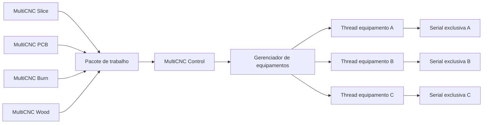

# 02 — Arquitetura e concorrência

## Visão geral



## Organização proposta do repositório

```text
apps/
  control/          controlador e interface de operação
  slice/            preparação para impressão 3D
  pcb/              fabricação de PCB a laser
  burn/             gravação e queima a laser
  wood/             criação e CAM para madeira
libs/
  domain/           equipamentos, trabalhos, perfis e estados
  serial/           ciclo de conexão e propriedade de portas
  protocols/        adaptadores de firmware
  jobs/             pacotes, integridade e validação
  geometry/         transformações, unidades e operações geométricas
  toolpaths/        representação de trajetórias e pós-processamento
  ui/               componentes visuais comuns
profiles/          perfis versionados e identificados
schemas/           contratos executáveis a implementar
tests/
  unit/
  integration/
  fixtures/
  hardware/        roteiros de bancada e evidências
docs/
```

Essa estrutura é alvo da implementação; a presente entrega não cria módulos vazios para aparentar funcionalidade.

## Plataforma proposta

O usuário definiu **Lazarus/Object Pascal** para o controlador, substituindo a sugestão preliminar de C++/Qt. A primeira implementação usa LCL e Free Pascal, com units separadas para domínio, protocolo, serial, worker e interface. A stack das aplicações de preparação permanece a definir. Manter o núcleo de domínio separado das interfaces.

Persistência futura proposta em SQLite, com escrita serializada em um serviço de armazenamento. A versão inicial Lazarus persiste apenas cadastros em INI; filas e logs persistentes ainda não existem. Projetos e pacotes grandes ficam em arquivos na arquitetura alvo. Trabalhos pesados de fatiamento e CAM devem executar fora da thread da interface, preferencialmente em processos separados para permitir cancelamento e isolamento.

## Modelo de threads do Control

- **Thread principal:** interface, seleção e apresentação de estados; nunca faz leitura serial bloqueante.
- **Gerenciador:** mantém os equipamentos e encaminha solicitações, sem escrever diretamente nas portas.
- **Uma worker thread por equipamento ativo:** possui exclusivamente porta, parser, adaptador, buffers, temporizadores e execução corrente. A thread nasce na conexão e é encerrada após limpeza na desconexão; o cadastro permanece.
- **Serviço de persistência:** recebe eventos por fila e grava histórico sem bloquear o ciclo de comunicação.

Mensagens cruzam threads por filas/sinais com cópia de dados imutáveis. Nenhuma interface recebe referência mutável para a porta. Cada mensagem inclui `device_id`, `session_id` e `request_id`; mensagens de sessões encerradas são descartadas. Callbacks de uma sessão antiga não podem alterar uma nova conexão.

## Exclusão e limites

Reservar a porta antes de iniciar a worker, usando identificação normalizada da porta e identificação do dispositivo quando disponível. Manter apenas uma instância do Control por usuário e adquirir exclusividade na abertura da porta; outros programas podem ocupá-la e isso deve aparecer como erro recuperável. Identificação USB auxilia, mas não autoriza reconexão ou execução automática.

Buffers de entrada, saída, eventos e logs terão limites configuráveis. O envio obedece à janela/acknowledgment do adaptador; enfileirar todo um arquivo diretamente na serial é proibido. Filas cheias aplicam contrapressão ou encerram a sessão com diagnóstico, sem descartar comandos silenciosamente.

## Encerramento e falhas

Parar a admissão de novos comandos, solicitar a ação suportada pelo firmware quando possível, registrar o estado conhecido e liberar a porta na própria worker. Se não houver confirmação do equipamento, registrar resultado indeterminado. O fechamento da aplicação não é prova de parada física.

Na falha de uma worker, isolar seu equipamento, manter os demais ativos e solicitar revisão do operador. Na reinicialização do Control, execuções ativas passam a interrompidas/indeterminadas; não são retomadas nem reenviadas automaticamente.

## Integração entre aplicações

Primeira etapa por exportação/importação de pacote. Integração posterior por IPC local com o Control: submissão, consulta e eventos, sem acesso direto à serial. IPC não é conexão com o equipamento e não altera a restrição de transporte serial.
