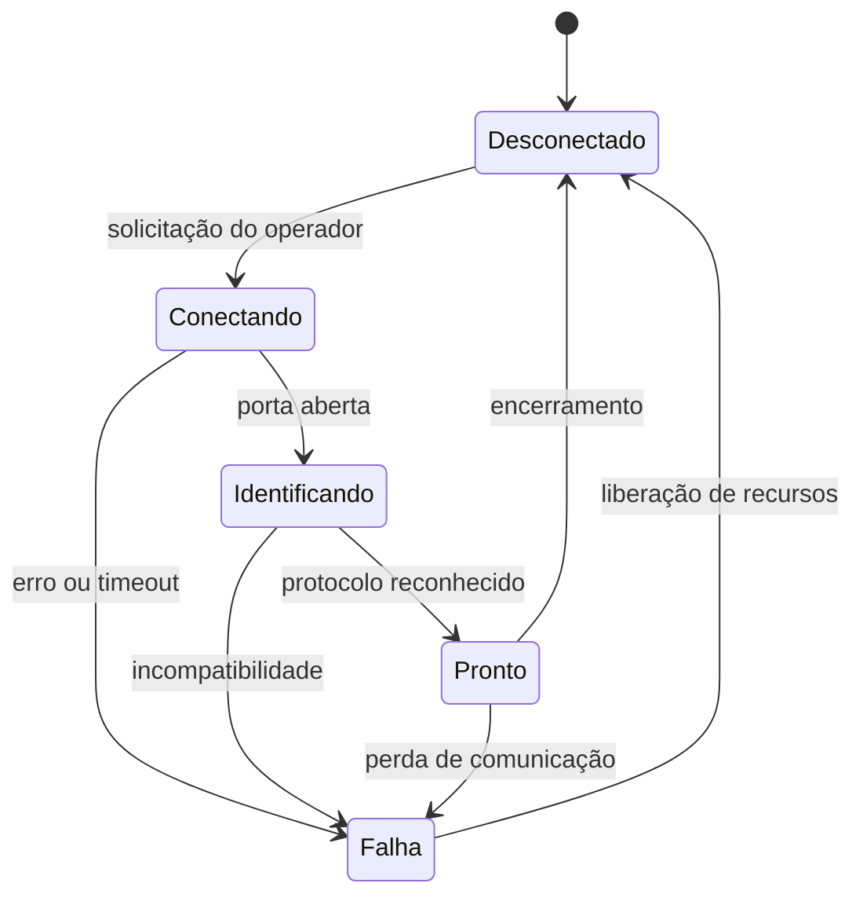

# 03 — MultiCNC Control

Este documento descreve o escopo alvo. A implementação inicial Lazarus e seus limites estão em `../OBJETIVO_CONTROLADOR.md`; campos como envelope mecânico, filas persistentes e histórico não estão todos implementados.

## Responsabilidade

Único proprietário das conexões com os equipamentos. Recebe trabalhos preparados, verifica compatibilidade, controla filas e apresenta a execução. Não modela peças nem realiza fatiamento/CAM.

## Cadastro de equipamento

| Campo | Regra |
| --- | --- |
| Identificador | UUID estável, independente da porta |
| Nome | Identificação escolhida pelo operador |
| Tipo | Laser, router ou impressora 3D |
| Marca e modelo | Obrigatórios para organização; opção explícita de equipamento próprio/desconhecido |
| Porta | Apenas porta serial enumerada pelo sistema ou informada manualmente |
| Parâmetros seriais | Baud rate, bits de dados, paridade, stop bits e controle de fluxo definidos pelo perfil |
| Firmware/protocolo | Adaptador e versão suportada, separados da marca/modelo |
| Perfil mecânico | Área/volume útil, eixos, unidades, origem e limites |
| Recursos | Laser, spindle, aquecimento, extrusão, homing e ações suportadas |
| Política de abertura | DTR/RTS e efeitos de reset documentados por perfil e validados em bancada |

Não assumir valores universais de velocidade serial, terminador de linha ou potência. Identificação automática é auxiliar: não substituir silenciosamente a configuração escolhida.

## Interface

- Visão geral: cartões com máquina, porta, estado e trabalho.
- Detalhe: identificação, posição quando disponível, progresso e alertas específicos do equipamento.
- Fila por equipamento: adicionar, remover e reordenar apenas trabalhos não iniciados.
- Preparação: resumo do trabalho, origem, limites, material, ferramentas e compatibilidade.
- Histórico: pacote, perfil, instantes, resultado, logs e diagnóstico.
- Configuração: cadastro e seleção de perfis, acessível sem operação ativa.

Controles de movimento manual, homing, temperatura, laser ou spindle aparecem somente quando implementados e homologados para o perfil. Console de comandos livres fica fora do MVP.

## Estado da conexão

Porta aberta não equivale a máquina pronta. O estado do trabalho é separado: `queued`, `validating`, `ready`, `running`, `pause_requested`, `paused`, `cancel_requested`, `completed`, `cancelled`, `failed`, `interrupted`.

## Regras de execução

1. Verificar integridade, perfil, recursos exigidos, limites conhecidos e disponibilidade.
2. Registrar execução e snapshot do perfil antes do primeiro comando.
3. Iniciar somente por ação explícita do operador sobre máquina e trabalho identificados.
4. Serializar envio conforme o adaptador, correlacionando respostas, erros e reenvios quando suportados.
5. Exibir separadamente comandos enviados, aceitos e conclusão física quando esta for observável. Um `ok` pode apenas indicar aceitação; não assumir movimento concluído.
6. Concluir somente pelo critério documentado e testado do adaptador. Sem evidência suficiente, informar estado indeterminado.

Comandos manuais não podem ser intercalados ao trabalho. Consultas e comandos em tempo real só podem usar mecanismos permitidos pelo protocolo. Timeout não provoca reenvio cego de um movimento; a política precisa considerar execução já iniciada e risco de duplicação.

## Pausa, cancelamento e parada

Pausa e cancelamento são solicitações, com estados pendentes até confirmação aplicável. Quando não suportados, os botões ficam indisponíveis e a limitação é informada. Cancelar não é apenas esvaziar a fila do computador: pode existir movimento no buffer do controlador. Desconectar e fechar o software não substituem a parada física de emergência.

Perda de cabo, reset, alarme ou timeout durante execução interrompe a sessão e exige intervenção. O software não retoma automaticamente. Aquecedores, laser e spindle devem seguir políticas específicas do equipamento; não há sequência universal segura para todos os controladores.

## Contrato do adaptador

Cada adaptador implementa conceitualmente: identificação, capacidades, codificação, parsing incremental, janela de envio, correlação de respostas, classificação de erros, consulta de estado, pausa/cancelamento e critério de conclusão. Métodos sem suporte retornam capacidade indisponível, nunca sucesso fictício.

## Aceite

Testar porta ocupada, respostas fragmentadas/agrupadas, ruído, buffer cheio, timeout, desconexão no meio de comando, resposta de sessão antiga, cancelamento pendente e execução simultânea. Homologar inicialmente uma combinação real de firmware/versão por categoria, escolhida após inventário dos equipamentos.
