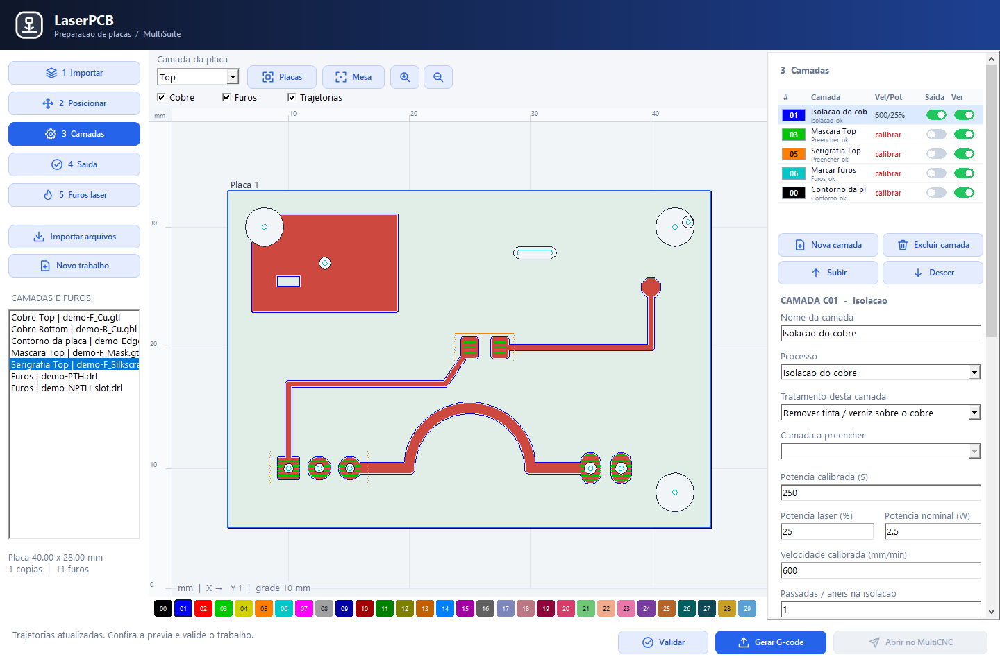
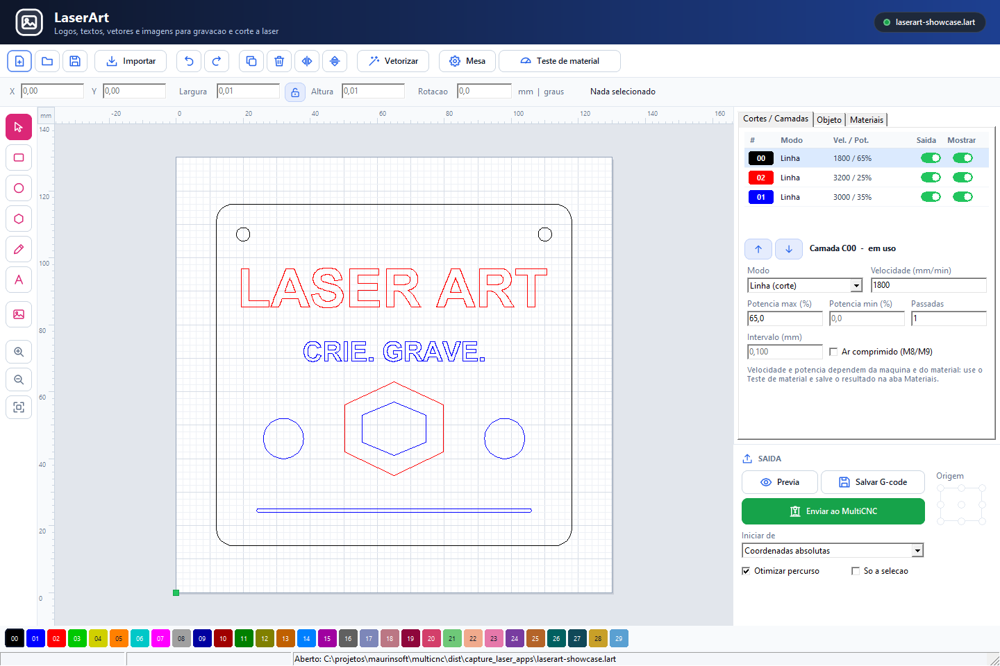

# Setup 007 — MultiSuite 0.07

Gerado em **10/10/2026**, para **Windows x64**, com Lazarus 4.6 e Free Pascal 3.2.2.

[Baixar setup_multcnc_007.exe](../setup/setup_multcnc_007.exe) · [Cópia em bin](../bin/setup_multcnc_007.exe) · [SHA256SUMS](../setup/SHA256SUMS)

## O que foi incluído

- 13 executáveis: MultiSuite Bandeja, MultiCNC, SimuCNC, MultiCAD, MultiAssembly, MultiPhysics, MultiCAM, MultiSlicer, MakePCB, MakeRouter, RouterPCB, LaserPCB e LaserArt.
- MultiCNC com equipamentos salvos por nome, compatibilidade com a versão GRBL detectada, catálogo de lasers comerciais e CUSTOM, GLYPHO S1 5W/10W e Frame.
- Janela Mesa compartilhada por LaserArt e LaserPCB: seleção de um equipamento laser salvo no MultiCNC e aplicação da área X/Y.
- LaserPCB com placas Top, Bottom, Top/Bottom ou N camadas em mm; processos laser por camada, potência em percentual/watts nominais, marcas e contornos de furos e referências publicadas.
- Biblioteca, galeria e criador de componentes do MakePCB reutilizados no LaserPCB. Importação de bibliotecas JSON e conjuntos .mpcb; posicionamento, rotação e face dos componentes.
- Bandeja com o padrão visual restaurado e os aplicativos existentes. MultiPCB, o hub multisuite.exe e a Central de Testes não são distribuídos; o setup remove suas cópias antigas.
- Seis imagens incorporadas durante a instalação, incluindo LaserPCB e LaserArt; inicialização da bandeja com o Windows selecionada por padrão e opcional.

## Capturas





[Galeria completa](../imgs/README.md) · [Guia LaserPCB](../laserpcb/README.md) · [Guia LaserArt](../laserart/README.md)

## Verificação do build

A compilação dos 13 aplicativos e do Inno Setup foi concluída. A bateria de console registrou **84 testes aprovados, zero falhas e um teste de integração TCP não executado**, pois exige SimuCNC em execução. Os sete testes do empacotamento também passaram. A integração de componentes e as regressões da interface LaserPCB foram executadas separadamente.

O pacote inclui `build-manifest.json` e `qa-tests.json`. O manifesto original registra base `7638e10` com alterações locais (`source_dirty=true`); o instalador é o snapshot desse build. A sincronização posterior do MultiCAD no Git não modifica o instalador já gerado.

As cópias em setup e bin foram comparadas por SHA-256:

```text
325445e8c57feef2b9a6241aa3dd4186b155e96ff8756b18b42b3fe1089e5bce  setup_multcnc_007.exe
```

Não foi realizada instalação automática neste computador. Consulte [as instruções do instalador](../installer/windows/README.md) para gerar ou instalar o pacote.
