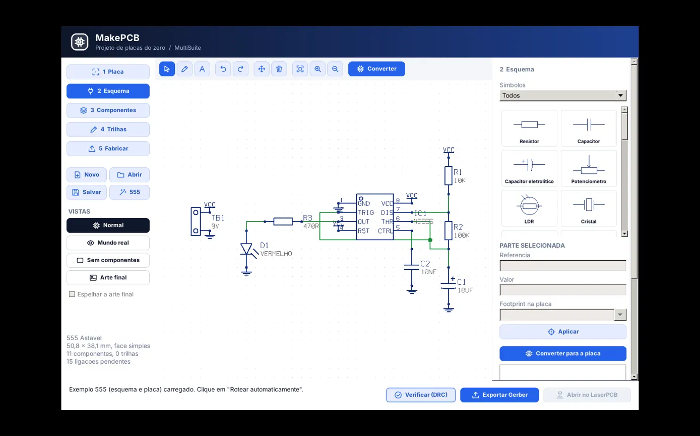
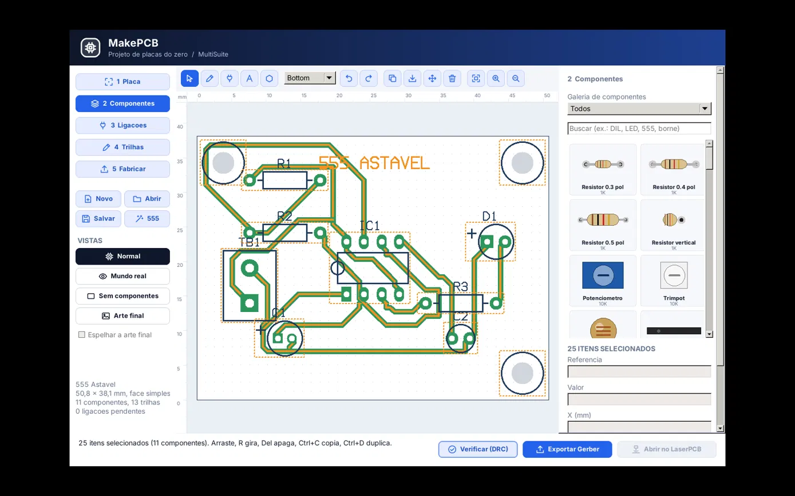
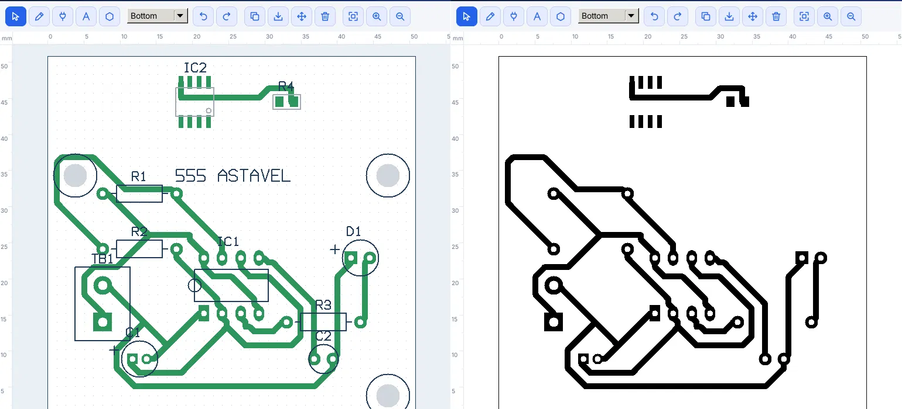
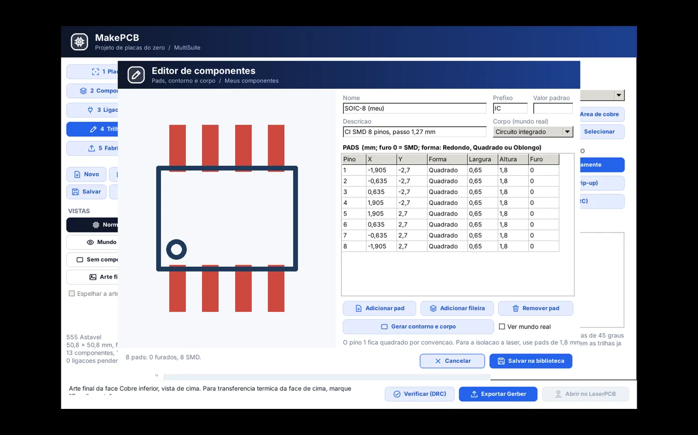
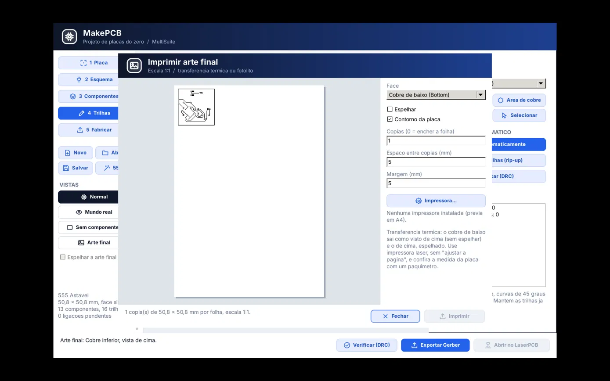
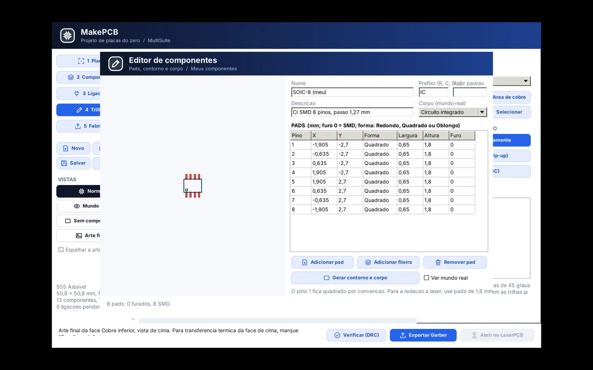

# MakePCB

Projeto de placas de circuito impresso **do zero**, no estilo do PCB Wizard,
gerando os arquivos que o **LaserPCB** consome (Gerber RS-274X/X2 + Excellon).

```
MakePCB  ──(Gerber + Excellon)──►  LaserPCB   ──(G-code)──►  MultiCNC (CNC Laser)
                                 └─►  RouterPCB  ──(G-code)──►  MultiCNC (CNC Router)   [planejado]
 desenho da placa                   isolacao a laser          execucao
```

## Telas

| | |
|---|---|
|  |  |
|  |  |
|  |  |

## Etapas (barra lateral)

| Etapa | O que faz |
|---|---|
| 1 Placa | nome, tamanho, face simples/dupla, largura de trilha, folga, grade |
| 2 Esquema | desenho do circuito com simbolos (passivos, diodos/LEDs, transistores, 78xx, 555, CIs DIL, conectores, GND/VCC e rotulos de rede), fios com juncoes e **Converter para a placa** (cria/atualiza os componentes e as ligacoes) |
| 3 Componentes | galeria com miniaturas (inclusive SMD e "Meus componentes"), busca, editor de componentes, propriedades, girar e virar (montar embaixo) |
| 4 Trilhas | trilha manual (45 graus), area de cobre, texto, **roteamento automatico** e **DRC** |
| 5 Fabricar | lista de materiais (CSV), Gerber + Excellon, **impressao 1:1** da arte final (varias copias por folha), PNG 600 dpi, abrir no LaserPCB |

Sem esquema, tambem da para ligar pad a pad direto na placa (etapa 2, "Ligacao pad a pad").

## Edicao

- Selecao por retangulo ou Shift+clique; arrastar move o grupo; setas movem um passo da grade.
- Ctrl+C / Ctrl+X / Ctrl+V / Ctrl+D (duplicar) / Ctrl+A, com o foco na placa. Colar leva as ligacoes internas e cria referencias novas.
- Trilha selecionada mostra alcas nos vertices: arraste para ajustar (encaixa em pad).

## SMD e componentes proprios

- Pad sem furo = SMD, so na face do componente. Em placa de face simples o SMD vai automaticamente
  embaixo (lado do cobre, espelhado). **F** ou o botao Virar troca a face.
- Biblioteca SMD: 0805, 1206, LED 1206, SOD-123, SOT-23, SOIC-8/14/16 (pads maiores que o IPC, para a isolacao a laser).
- Editor de componentes: pads em tabela (furo 0 = SMD), fileiras, contorno e corpo automaticos, previa ao vivo.
  Fica em "Meus componentes" (`makepcb_componentes.json` na pasta de configuracao do usuario) e vai
  embutido em cada `.mpcb` que o usar, para abrir em outra maquina.

## Vistas (como as abas do PCB Wizard)

- **Normal** – edicao: grade de pontos, Top em vermelho e Bottom em verde (mesmas cores do LaserPCB), contornos e ligacoes pendentes tracejadas.
- **Mundo real** – placa montada: FR4 com mascara, pads estanhados, serigrafia branca e corpo de cada componente.
- **Sem componentes** – a placa nua.
- **Arte final** – cobre preto em fundo branco para conferir/imprimir; opcao de espelhar.

## Atalhos

| Tecla | Acao |
|---|---|
| R | gira 90 graus (selecao ou componente a colocar) |
| F | vira o componente (em cima / embaixo) |
| Setas | movem a selecao um passo da grade |
| Del | apaga a selecao |
| Esc | cancela / volta para Selecionar |
| Backspace | desfaz o ultimo ponto da trilha/area |
| Ctrl (segurado) | trilha livre, sem travar em 0/45/90 graus |
| Roda do mouse | zoom no cursor; botao do meio arrasta a vista |
| Ctrl+Z / Ctrl+Y | desfazer / refazer |
| Ctrl+N / Ctrl+O / Ctrl+S | novo / abrir / salvar |

## Arquivos

- Projeto: `.mpcb` (JSON): placa, esquema e os componentes do usuario usados.
- Exportacao em `<pasta do projeto>/<nome>_gerber/`:

| Arquivo | Conteudo |
|---|---|
| `<nome>-B_Cu.gbl` | cobre inferior |
| `<nome>-F_Cu.gtl` | cobre superior (dupla face ou opcao marcada) |
| `<nome>-B_Mask.gbs` / `-F_Mask.gts` | mascara de solda |
| `<nome>-F_Silkscreen.gto` | serigrafia |
| `<nome>-Edge_Cuts.gm1` | contorno |
| `<nome>-PTH.drl` / `-NPTH.drl` | furos metalizados / de fixacao |

"Abrir no LaserPCB" chama `laserpcb --file <pasta>`; o LaserPCB importa a pasta
inteira e, em face simples, ja abre pelo lado Bottom.

## Impressao (transferencia termica / fotolito)

"Imprimir arte final (1:1)" usa os DPI da impressora. Escolha a face, espelhamento e quantas copias
por folha (0 = encher). O cobre de baixo sai como visto de cima (sem espelhar); o de cima, espelhado.
Confira a medida impressa com um paquimetro.

## Compilar

```
lazbuild makepcb/src/app/makepcb.lpi
lazbuild makepcb/tests/test_makepcb.lpi    && makepcb/tests/test_makepcb
lazbuild makepcb/tests/test_makepcb_ui.lpi && makepcb/tests/test_makepcb_ui
```

Detalhes internos em [docs/ARCHITECTURE.md](docs/ARCHITECTURE.md).
