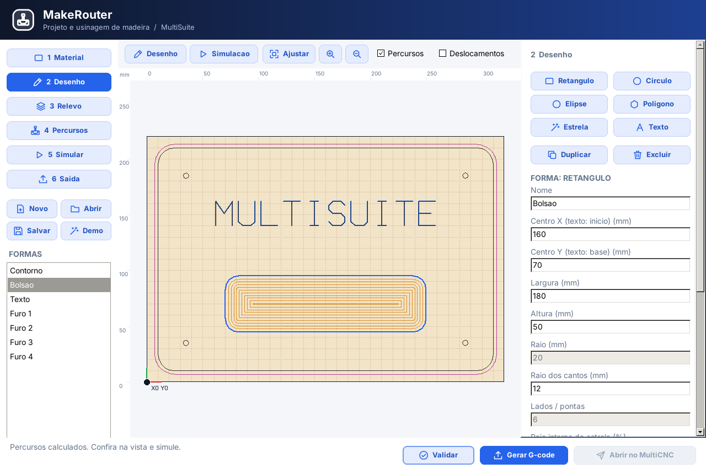
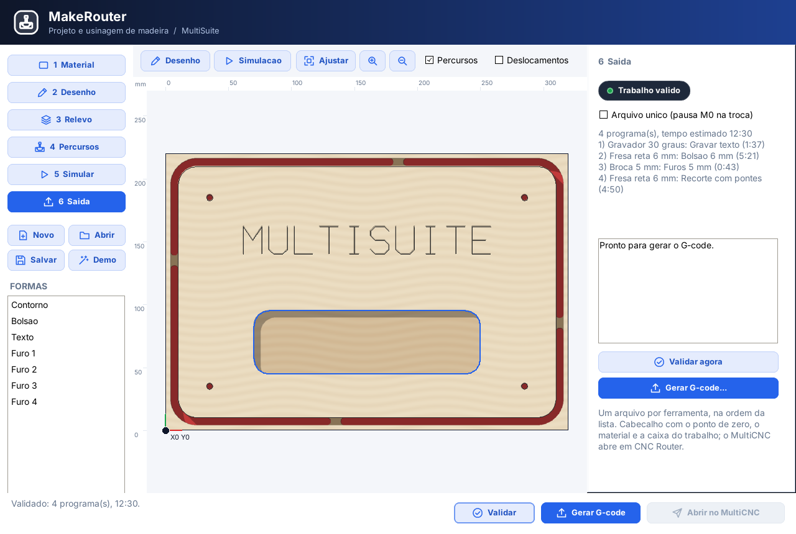

# MakeRouter

> **Estado (08/10/2026):** primeira versão **2,5D** pronta (`bin/makerouter.exe`, instalador
> 0.05). Já faz material e zero virtual, formas, perfil com pontes, bolsão, furação, gravação,
> simulação sombreada e G-code para o MultiCNC. **Ainda não tem** V-Carve (fase 5), relevo 3D
> (fase 6) nem importação DXF/SVG. O andamento está em [docs/TAREFA.md](docs/TAREFA.md).

| | |
|---|---|
|  |  |
|  |  |

## Uso rápido

1. **Demo** abre a placa de exemplo (320 × 220 × 18 mm): texto gravado, bolsão, 4 furos e
   recorte com pontes.
2. **1 Material:** tamanho, espessura, ponto de zero (9 botões) e Z no topo ou na mesa.
3. **2 Desenho:** adicione formas e edite as medidas, ou arraste na vista (Shift soma à
   seleção, Delete exclui).
4. **4 Percursos:** selecione as formas, crie Perfil, Bolsão, Furação ou Gravação, escolha a
   ferramenta e as profundidades e clique em **Calcular**.
5. **5 Simular:** veja a remoção do material. Vermelho indica corte abaixo da base, o que é
   normal no recorte (a fresa entra na base de sacrifício).
6. **6 Saída:** **Validar** e **Gerar G-code** (escolha a pasta). Depois, **Abrir no MultiCNC**,
   leve a fresa ao ponto de zero, clique em Zero Workpiece e confira com Frame (Test).

O **MakeRouter** é o programa da suíte para **projetar e usinar peças de madeira** (MDF,
compensado, madeira maciça, acrílico) na CNC Router. Na mesma ferramenta o usuário:

1. desenha a peça;
2. modela o relevo, quando houver;
3. escolhe as ferramentas e os percursos;
4. confere a usinagem numa simulação 3D;
5. envia o G-code para o **MultiCNC**, que posiciona a peça na máquina e executa.

```text
MakeRouter (desenho + relevo + percursos + simulacao) --G-code com zero virtual--> MultiCNC (CNC Router)
                                                                                    |
                                       o operador leva a ferramenta ao ponto de zero, "Zero Workpiece",
                                       "Frame (Test)" e inicia
```

O Vectric Aspire é a **referência de fluxo**, não de cópia. A ideia que vale manter é ter
vetores, relevo, percursos e simulação no mesmo lugar, com uma lista de percursos que se
recalcula quando o desenho muda. A interface segue o padrão visual da suíte, como no MakePCB, no
LaserPCB e no RouterPCB:

- cabeçalho `TSuiteHeader`;
- barra lateral com as etapas numeradas;
- painel de parâmetros à direita;
- vista 2D/3D ao centro;
- rodapé com Validar, Gerar G-code e Abrir no MultiCNC.

## Zero virtual: a peça não sabe onde está na máquina

O MakeRouter **nunca** gera coordenadas da mesa da máquina. Todo o projeto fica relativo ao
**material** (*stock*), e o G-code sai relativo a um **ponto de zero escolhido no material**:

- **XY:** um dos 9 pontos do material (4 cantos, 4 meios de borda ou centro). O padrão é o canto
  inferior esquerdo.
- **Z:** a **superfície do material** (padrão) ou a **mesa/base de sacrifício**.

O G-code leva no cabeçalho o tamanho do material e o ponto de zero. No **MultiCNC**, o operador:

1. leva a ferramenta até esse ponto real da peça presa na mesa;
2. clica em **Zero Workpiece**;
3. confere o contorno com **Frame (Test)**;
4. inicia.

Mover a peça na mesa não exige gerar o G-code de novo, só refazer o zero. É o mesmo princípio
do RouterPCB, em que o zero fica no canto da placa e na superfície do cobre. O contrato comum
está em [../docs/CONTRATO_GCODE.md](../docs/CONTRATO_GCODE.md).

## Etapas (o que já existe e o que falta)

| Etapa | O que acontece |
|---|---|
| **1 Material** | Largura, altura e espessura do material, unidade (mm), ponto de zero XY (9 pontos) e Z (topo ou mesa), base de sacrifício, Z seguro e posição de retorno (*home*) relativa ao zero. Material visual (pinus, MDF, maple...) só para a prévia. |
| **2 Desenho** | Vetores: retângulo (com cantos arredondados), círculo, elipse, polígono, estrela, arco, polilinha, curva e texto (fontes do sistema convertidas em contorno). Importação de DXF e SVG. Mover, girar, espelhar, escalar, alinhar, distribuir, soldar, subtrair, interseção, *offset*, unir vetores abertos e matriz/cópia em grade. Camadas de desenho. |
| **3 Relevo** *(fase 6, falta)* | Modelo 3D da peça como **mapa de alturas** (como os componentes do Aspire, em versão simples): domo, rampa/ângulo, prisma e extrusão a partir de vetor, revolução, imagem em tons de cinza → relevo e importação de STL (projetado de cima). Combinação por somar, subtrair, máximo e mínimo. |
| **4 Percursos** | Lista de percursos com ferramenta, profundidades e parâmetros. Cada percurso pode ser ligado, desligado, recalculado e reordenado. Tipos: **Perfil** (fora, dentro ou na linha, com pontes, rampa e entrada/saída), **Bolsão** (*pocket*, com limpeza em zigue-zague ou offset), **Furação**, **Gravação em linha**, **V-Carve** (fresa V com profundidade variável), **Desbaste 3D** e **Acabamento 3D**. |
| **5 Simular** | Remoção de material num mapa de alturas do *stock*, vista 3D com textura de madeira, simulação de um percurso ou de todos, tempo estimado e alertas de colisão do porta-ferramenta e de mergulho rápido no material. |
| **6 Saída** | Validação (limites, ferramenta mais larga que o detalhe, profundidade maior que o material, pontes, Z seguro) e G-code GRBL. Gera um arquivo por ferramenta ou um único arquivo com pausa M0 para trocar a fresa. O botão "Abrir no MultiCNC" abre o primeiro programa. |

## Inspiração das telas de referência

As capturas enviadas (Aspire 10/12 e um exemplo de móveis) mostram o que importa no fluxo:

- **Bandeja com relevo:** acabamento 3D com fresa esférica sobre um modelo de alturas, depois o
  recorte. Corresponde às etapas 3, 4 e 5.
- **Painéis de móveis em chapa:** furação por diâmetro, rasgo (*groove*), bolsão e perfil
  com pontes na chapa inteira. Corresponde às etapas 2 e 4, com vários percursos por ferramenta.
- **Texto projetado sobre domo:** gravação que acompanha a superfície 3D. Fica para a fase
  posterior do V-Carve e da gravação.
- **Placa "The Eagle Inn":** relevo, V-Carve no texto e perfil com pontes. A lista de
  percursos mostra ferramenta, avanço, mergulho, RPM, Z seguro, profundidade máxima e tempo
  estimado. Isso vai para o painel da etapa 4.

O que **não** se copia: menus, ícones, nomes comerciais, o formato `.crv` e a disposição exata
dos painéis. O visual é o da MultiSuite.

## Documentação

- [docs/ARCHITECTURE.md](docs/ARCHITECTURE.md): unidades, modelo de dados, algoritmos e o que
  é reaproveitado da suíte.
- [docs/TAREFA.md](docs/TAREFA.md): fases, critérios de pronto e as decisões que precisam da
  sua análise.
- [docs/AI_GUIDE.md](docs/AI_GUIDE.md): responsabilidades e limites, para quem for alterar o
  código.
- [../docs/CONTRATO_GCODE.md](../docs/CONTRATO_GCODE.md): zero virtual e cabeçalho comum entre
  as ferramentas e o MultiCNC.
